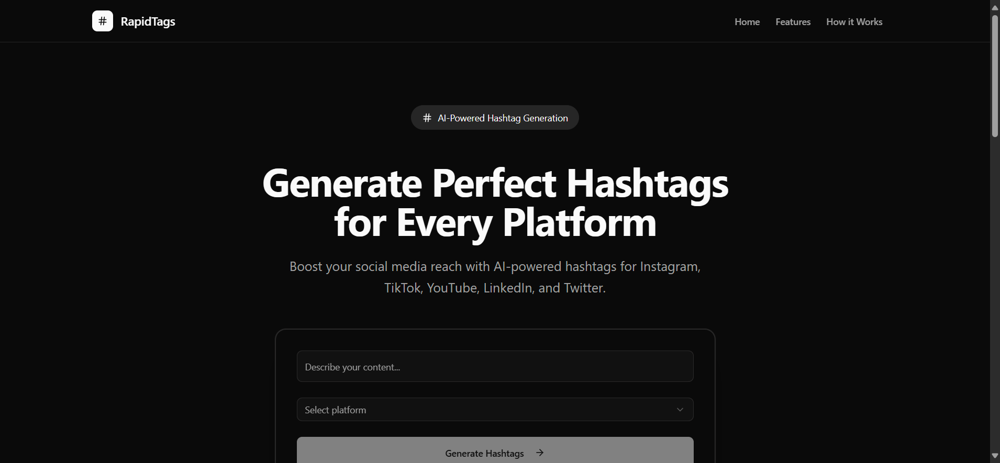
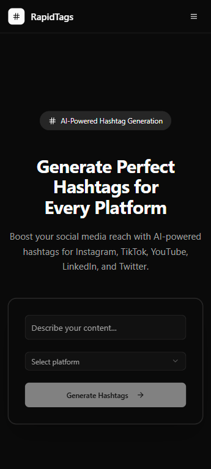

# Rapitags.online - AI-Powered Hashtag Generator

Rapitags.online is an AI-powered tool that helps you generate relevant and effective hashtags for your social media content, especially for YouTube videos. Simply enter the title of your video, and our AI will provide you with a list of optimized hashtags to improve your content's visibility.

## ✨ Features

- **AI-Powered Hashtag Generation:** Get smart hashtag suggestions based on your content.
- **Easy to Use:** Simple and intuitive interface for a seamless experience.
- **Copy to Clipboard:** Quickly copy the generated hashtags with a single click.
- **Responsive Design:** Works beautifully on all devices, whether desktop or mobile.
- **Lightweight and Fast:** Built with modern technologies for optimal performance.

## 🚀 Live Demo

You can access the live application here: [https://rapitags.online](https://rapitags.online)

## 📸 Screenshots

| Wide                                   | Narrow                                 |
| -------------------------------------- | -------------------------------------- |
|  |  |

## 💡 Usage

1. **Enter a title:** In the input field, type in the title of your video or a keyword related to your content.
2. **Generate Hashtags:** Click the "Generate" button.
3. **Copy Hashtags:** The generated hashtags will appear below. You can then copy them to your clipboard.

## 💻 Technologies Used

- **[Next.js](https://nextjs.org/):** A React framework for building server-side rendered and statically generated web applications.
- **[React](https://reactjs.org/):** A JavaScript library for building user interfaces.
- **[TypeScript](https://www.typescriptlang.org/):** A typed superset of JavaScript that compiles to plain JavaScript.
- **[Tailwind CSS](https://tailwindcss.com/):** A utility-first CSS framework for rapidly building custom designs.
- **[Shadcn/ui](https://ui.shadcn.com/):** A collection of re-usable UI components.
- **[Lucide React](https://lucide.dev/):** A library of simply designed, beautiful icons.
- **[Sonner](https://sonner.emilkowal.ski/):** A toast notification library for React.
- **[Axios](https://axios-http.com/):** A promise-based HTTP client for the browser and Node.js.

## ⚙️ How it Works

1. **User Interaction:** The user enters a title or keyword and selects a platform.
2. **API Request:** When the "Generate Hashtags" button is clicked, a request is made to the backend.
3. **Backend Forwarding:** The backend forwards the request to an external AI service.
4. **AI Processing:** The external AI service processes the request and generates the hashtags.
5. **Displaying Results:** The application receives the hashtags and displays them to the user.
6. **Copy to Clipboard:** The user can then select the desired hashtags and copy them to their clipboard.
